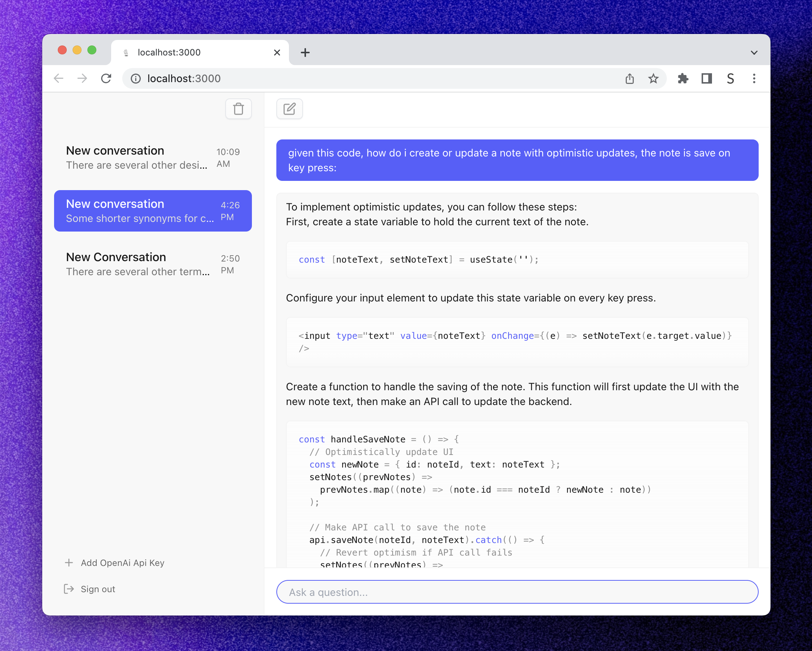

# [chatcopilot.app](https://github.com/sambarrowclough/chatcopilot)

An open-source ChatGPT UI with a fresh coat of paint and authentication.

[](https://www.chatcopilot.app)

## Introduction

Chatcopilot is a chat UI for ChatGPT built with Next.js, Tailwind, and Supabase. You paste in your OpenAI API key and you're good to go.

## Running Locally

### Cloning the repository the local machine.

```bash
git clone https://github.com/sambarrowclough/chatcopilot.git
```

### Storing the API keys in .env

Create a file in root directory of project with env. And store your API key in it, as shown in the .example.env file.

### Installing the dependencies.

```bash
npm install
```

### Running the application.

Then, run the application in the command line and it will be available at `http://localhost:3000`.

```bash
npm run dev
```

## Auth setup

1. Use `openssl rand -base64 32` to generate NEXTAUTH_SECRET
2. Create a new project in [supabase.io](https://supabase.io)
3. Follow the [Supabase Prisma Integration](https://supabase.com/docs/guides/integrations/prisma) guide to setup Prisma
4. Run `npx prisma db push && prisma migrate dev && prisma generate`

## Email setup

1. Create a new project in [postmark](https://postmarkapp.com/)
2. Create a server
3. Generate a Server API tokens
4. Paste in the API token in `POSTMARK_API_TOKEN` in `.env`

## Tech Stack

- [Next.js](https://nextjs.org/) – framework
- [Typescript](https://www.typescriptlang.org/) – language
- [Tailwind](https://tailwindcss.com/) – CSS
- [Postmark](https://postmarkapp.com/) – email
- [Supabase](https://supabase.io) – database
- [NextAuth.js](https://next-auth.js.org/) – auth
- [Vercel](https://vercel.com/) – hosting

## One-Click Deploy

Deploy the example using [Vercel](https://vercel.com?utm_source=github&utm_medium=readme&utm_campaign=vercel-examples):

[](https://vercel.com/new/clone?repository-url=https://github.com/sambarrowclough/chatcopilot&env=DATABASE_URL,NEXTAUTH_SECRET,POSTMARK_API_TOKEN,SHADOW_DATABASE_URL,NEXTAUTH_URL,FROM_EMAIL&project-name=chatcopilot&repo-name=chatcopilot)

> Note: You will need to configure auth by following the setup above by using Supabase and next-auth
